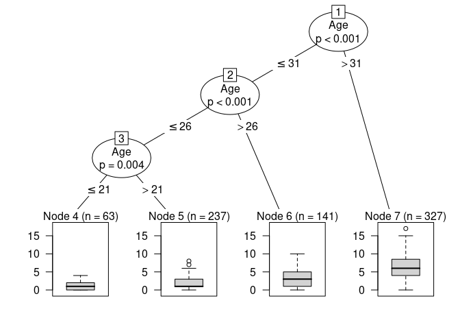
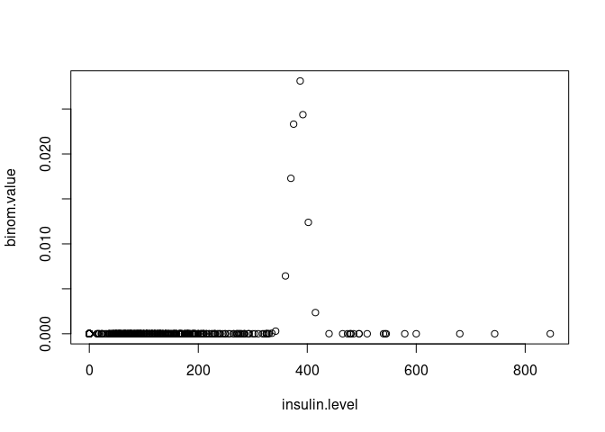
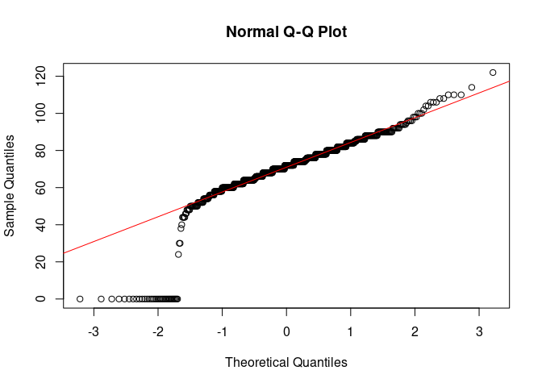
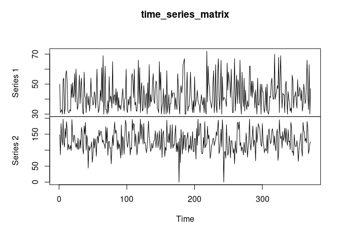
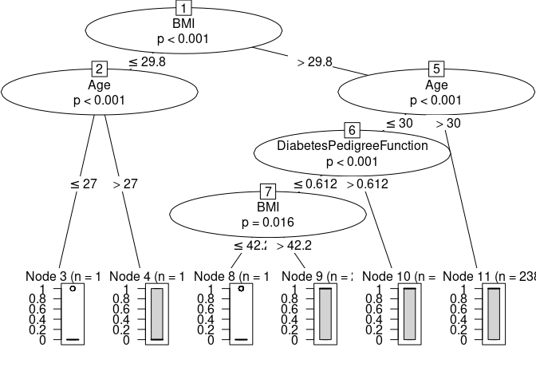

Diabetes database analysis.
===========================

------------------------------------------------------------------------

##### **Q. Find total record for class 0 and class 1 from the outcome column.**

``` r
positive = subset(diabetes,diabetes$Outcome==1)
negative = subset(diabetes,diabetes$Outcome==0)
View(positive)
View(negative)
```

##### **Q. Find Distinct values for different attributes (Columns) and print total count for each.**

``` r
library("plyr")
(ldply(diabetes, function(x) data.frame(table(x))))
```

##### **Q. What is the Gini coefficient of the attributes(Columns).**

``` r
gini(diabetes$Pregnancies)
gini(diabetes$Glucose)
gini(diabetes$BloodPressure)
gini(diabetes$SkinThickness)
gini(diabetes$Insulin)
gini(diabetes$BMI)
gini(diabetes$DiabetesPedigreeFunction)
gini(diabetes$Age)
gini(diabetes$Outcome)
```

##### **Q. Find DiabetesPedigreeFunction which is &lt; .200 if skin thickness and Insulin is 0 .**

``` r
subset(diabetes, diabetes$SkinThickness==0 & diabetes$Insulin==0 & diabetes$DiabetesPedigreeFunction<0.200)
```

##### **Q. Check what will be the blood pressure level if pregnancies count is 10 and print the average BP level.**

``` r
BP_for_preg_10 = subset(diabetes,Pregnancies==10,select= BloodPressure)
print(mean(BP_for_preg_10$BloodPressure))
View(BP_for_preg_10)
```

##### **Q. Print first 3 Highest and Lowest count of pregnancies and print the age **

``` r
#Lowest
x = diabetes$Pregnancies
index = which(x == sort(unique(x) )[1:3] )
View(diabetes[c(index),c(1,8)])

#Highest
x = diabetes$Pregnancies
index = which(x == sort(unique(x),decreasing = TRUE )[1:3] )
View(diabetes[c(index),c(1,8)])
```

##### **Q. Check if someone having BMI level o then BP should be &gt; 90 **

``` r
BMI_0_BP_90 = subset(diabetes,BMI==0&BloodPressure>90)
View(BMI_0_BP_90)
BMI_0_BP_NOT90 = subset(diabetes,BMI==0&BloodPressure<=90)
View(BMI_0_BP_NOT90)
```

##### **Q. Print all the rows which contains only one 0 in at least one column.**

``` r
View(subset(diabetes, apply(diabetes,1, function(x) length(which(x==0))==1 )))
```

##### **Q. Print all the rows which contains 0 in more than one columns.**

``` r
morethan_1_0 = subset(diabetes,apply(diabetes,1,function(x) length(which(x==0)))>1)
View(morethan_1_0)
```

##### **Q. Print all the rows if Glucose level is &lt; 100.**

``` r
View(subset(diabetes, diabetes[,2] < 100))
```

##### **Q. Print all the age which is &lt; then 35 and BP is &gt; 60.**

``` r
agelessthan_35_BPmorethan_60 = subset(diabetes,Age<35&BloodPressure>60,select=c(Age))
View(agelessthan_35_BPmorethan_60)
```

##### **Q. Print decision tree of pregnancies on the basis of Age,BP and Insulin.**

``` r
output = ctree(Pregnancies ~ Age+BloodPressure+Insulin,
               diabetes)
plot(output)
```



##### **Q. Print all the values in BP columns where values in equal digit (Ex. 66 ,99).**

``` r
doubledigit = subset(diabetes,grepl("(0|1|2|3|4|5|6|7|8|9)\\1",diabetes$BloodPressure))
View(doubledigit)
```

##### **Q. Find ANOVA method for the database.**

``` r
# taking 'Insulin' as response, 'Glucose' as predictor 
# and 'Outcome' as categorical variable
result1 = aov(Insulin~Glucose*Outcome,data = diabetes)
result2 = aov(Insulin~Glucose+Outcome,data = diabetes)
print(anova(result1,result2))
```

##### **Q. Print all the Glucose value where insulin value is equal to 0.**

``` r
# taking 'Insulin' as response, 'Glucose' as predictor 
# and 'Outcome' as categorical variable
glucose_insulin0 = subset(diabetes,Insulin==0,select=Glucose)
View(glucose_insulin0)
```

##### **Q. Find Binomial distribution of database**

``` r
#binomial distribution for 'Insulin'
insulin.level = diabetes$Insulin
binom.value = dbinom(insulin.level, length(insulin.level), 0.5)
plot(insulin.level, binom.value)
```



##### **Q. Check if database if normally distributed**

``` r
#checking if 'Blood Pressure' is normally distributed using a qqplot
bp.level = diabetes$BloodPressure
qqnorm(bp.level)
qqline(bp.level, col = 2)
```



##### **Q. Find prediction of pregnancies on the basis of DiabetesPedigreeFunction.**

``` r
model = lm(Pregnancies~DiabetesPedigreeFunction,data=diabetes)
intercpt=coef(model)[1]
XDPF = coef(model)[2]
avg= mean(diabetes$DiabetesPedigreeFunction)
newpredict = intercpt + XDPF*avg #for average DPF
print(newpredict)
```

##### **Q. Print scatter plot for the database.**

``` r
plot(diabetes[c(1:10),])
```

##### **Q. Print time series analysis basis on Age (30-80) as per glucose value.**

``` r
age_30_80 = subset(diabetes,Age>29&Age<81)
time_series_age = ts(age_30_80$Age,start=1,end=371,frequency = 1)
time_series_glucose = ts(age_30_80$Glucose,start=1,end=371,frequency = 1)
age_glucose_matrix = matrix(c(time_series_age,time_series_glucose),nrow=371)
time_series_matrix = ts(age_glucose_matrix,start=1,end=371,frequency = 1)
plot(time_series_matrix)
```



##### **Q. Find logical distribution basis on outcomes.**

``` r
model = lm(Outcome~Pregnancies+Glucose+BloodPressure+SkinThickness+Insulin+BMI+DiabetesPedigreeFunction+Age,data=diabetes)
x = c(coef(model)[2],coef(model)[3],coef(model)[4],coef(model)[5],coef(model)[6],coef(model)[7],coef(model)[8],coef(model)[9])
max_3 = sort(x,decreasing = T)
max_3 = max_3[1:3]
model = lm(Outcome~BMI+DiabetesPedigreeFunction+Age,data=diabetes) #check for the values in max using above given characterstics of model
tree = ctree(Outcome~BMI+DiabetesPedigreeFunction+Age,diabetes)
plot(tree)
```


